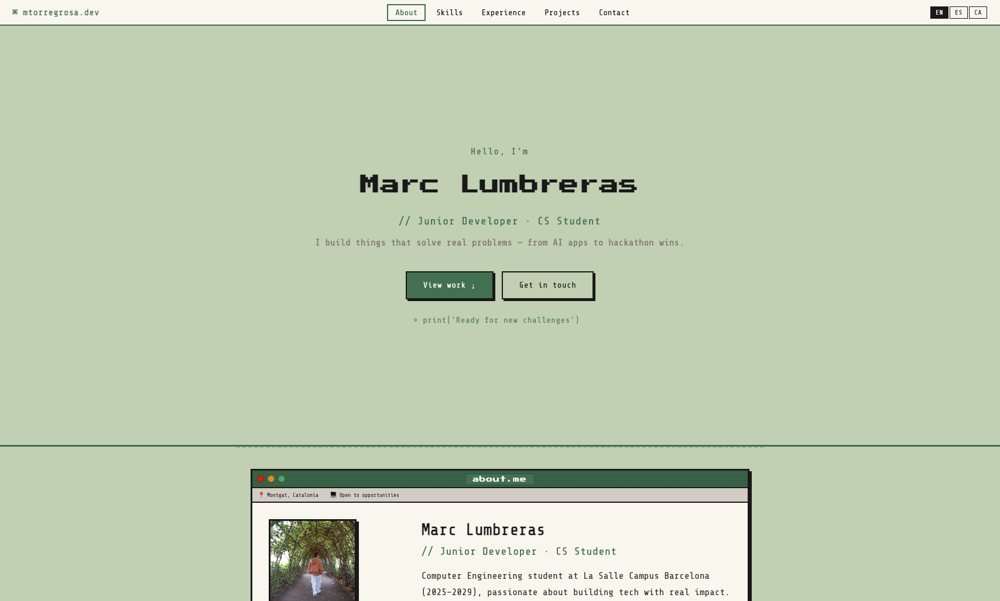
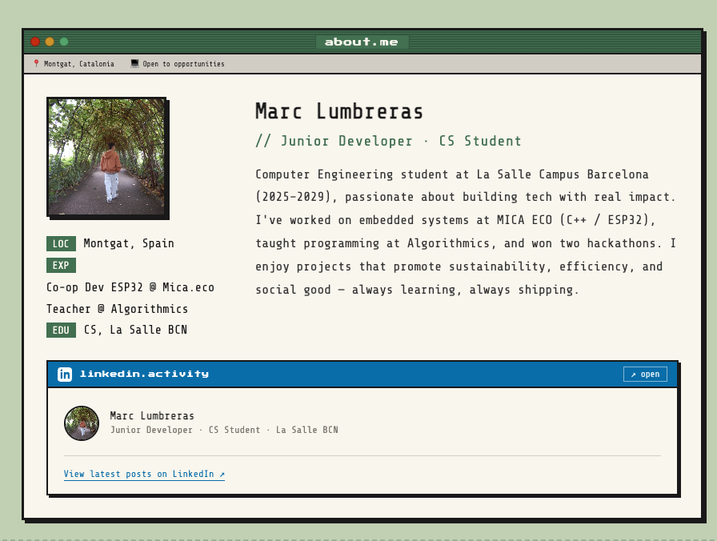
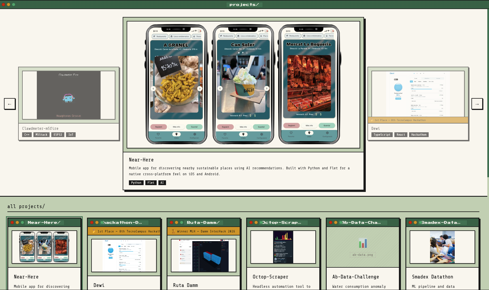
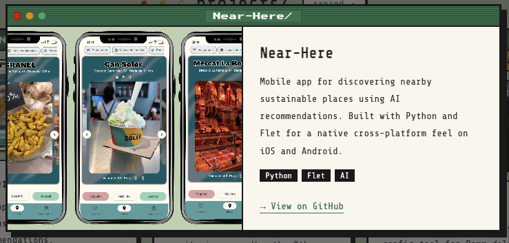
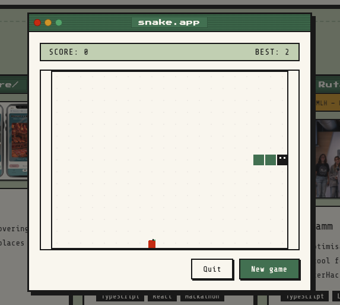

# 🕹️ mtorregrosa.dev

<p align="center">
  <strong>Personal portfolio of Marc Lumbreras</strong><br />
  <em>Junior Developer & Computer Engineering student @ La Salle BCN</em>
</p>

<p align="center">
  <a href="https://mtorregrosadev.github.io">
    
  </a>
  <a href="LICENSE">
    
  </a>
</p>

---

## 🎨 Gallery

| **Desktop Overview** | **About Me** |
|:---:|:---:|
|  |  |

| **Projects Carousel** | **Project Details (Modal)** |
|:---:|:---:|
|  |  |

<p align="center">
  <strong>Interactive Snake Easter Egg</strong><br />
  
</p>

---

## 🛠️ Features & Tech Stack

- **💎 Vanilla Everything:** Built with pure **HTML5**, **CSS3**, and **Vanilla JavaScript**. No frameworks, no libraries, no build steps. Just clean, optimized code.
- **📟 Retro Aesthetic:** A responsive, pixel-perfect design inspired by classic macOS and Terminal interfaces.
- **🌍 Dynamic i18n:** Full support for **English**, **Spanish**, and **Catalan**. Text is dynamically injected from `translations.json` without reloading the page.
- **🖥️ Interactive Terminal:** A custom-built terminal emulator in the contact section with history support, various commands, and hidden ASCII art.
- **⚡ High Performance:** Optimized assets served in **WebP** format and lazy-loaded for a near-instant experience.

---

## 🗂️ Project Structure

```text
mtorregrosa.dev/
├── index.html          — Semantic HTML5 structure
├── styles.css          — Retro UI system and animations
├── main.js             — Core logic (i18n, terminal, carousel, snake)
├── translations.json   — Centralized source for all multilingual text
└── src/                — High-performance optimized assets
    ├── photo.webp        — Profile picture
    ├── clawdmeter-*.webp — Screenshots for Clawdmeter-m5fire project
    ├── datathon-*.webp   — ML pipeline project visuals
    ├── NearHere.webp     — App screenshot
    ├── Dewi-Hack.webp    — Hackathon project screenshot
    ├── interhack-*.webp  — Ruta Damm / InterHack 2026 gallery
    └── empreses/         — Company logos (Algorithmics, Mica, Som-hi)
```

---

## 💻 Interactive Terminal

Try these commands in the site's terminal window:
- `help` — List all available commands.
- `whoami` — A brief introduction.
- `ls` — List major projects.
- `contact` — Quick links to Email, GitHub, and LinkedIn.
- `cat about.txt` — Read my full bio.
- **ASCII Art:** `happymac`, `sadmac`, `bomb`, `boot`, `coffee`, `matrix`.

---

## 🕹️ Easter Eggs

### Classic Snake Game
Launch the classic Snake game via:
1. Typing `snake` or `play` in the terminal.
2. Clicking the `⌘` logo in the navbar.
3. Entering the **Konami code**: `↑ ↑ ↓ ↓ ← → ← → B A`.

---

## 🚀 Running Locally

The site works directly via `file://`, but a local server is recommended for the best experience with translation loading:

```bash
# Using Python
python3 -m http.server 8080

# Using Node.js (npx)
npx serve .
```

Open your browser at `http://localhost:8080`.
